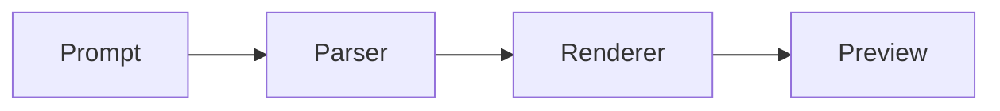

# Streaming Content

This text appears progressively...

# Markstream Test Lab

在这里可以快速验证 **Vue 3 / Vue 2 / React / Angular** 四套渲染器的表现是否一致。

## 基础格式

- **加粗**
- *斜体*
- `inline code`
- [链接](https://github.com/Simon-He95/markstream-vue)

## 数学

行内公式：$E = mc^2$

块级公式：

$$
\int_0^1 x^2 dx = \frac{1}{3}
$$

## Mermaid



## 代码块

```ts
export function compareFramework(name: string) {
  return `${name} test page is ready.`
}
```

## Infographic

```infographic
infographic list-row-simple-horizontal-arrow
data
  items
    - label 输入
      desc markdown
    - label 渲染
      desc 解析与增量更新
    - label 对照
      desc 跨框架检查
```

## D2

```d2
App: Angular
Parser: Markdown AST
Renderer: Enhanced HTML
Lab: Playground/Test

App -> Parser -> Renderer -> Lab
```
