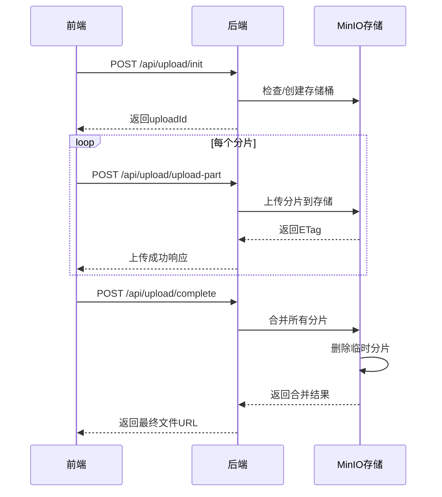

# 大文件分片上传系统

这是一个基于Vue.js前端和Node.js后端的大文件分片上传系统，集成了MinIO对象存储。

## 系统架构

```
┌─────────────┐    HTTP    ┌─────────────┐    MinIO    ┌─────────────┐
│   Vue前端   │ ──────────▶ │ Node.js后端 │ ──────────▶ │  MinIO存储  │
│             │             │             │             │             │
│ • 文件选择  │             │ • 分片管理  │             │ • 对象存储  │
│ • 进度显示  │             │ • 接口转发  │             │ • 数据持久  │
│ • 日志记录  │             │ • 错误处理  │             │             │
└─────────────┘             └─────────────┘             └─────────────┘
```

## 功能特性

- ✅ 大文件分片上传（支持GB级文件）
- ✅ 实时上传进度显示
- ✅ 多文件并发上传
- ✅ 上传速度和剩余时间计算
- ✅ 上传取消功能
- ✅ 详细的日志记录
- ✅ MinIO对象存储集成
- ✅ RESTful API接口
- ✅ 响应式UI界面

## 技术栈

### 前端
- Vue 3
- Vite
- Axios
- 纯CSS样式

### 后端
- Node.js
- Express.js
- MinIO JavaScript SDK
- Multer（文件处理）

### 存储
- MinIO对象存储

## 快速开始

### 1. 环境准备

确保安装以下软件：
- Node.js >= 14.0.0
- MinIO Server

### 2. 启动MinIO服务

#### Windows:
双击运行 `start-minio.bat` 文件

#### 或手动启动:
```bash
# 下载MinIO服务器
# Windows: https://dl.min.io/server/minio/release/windows-amd64/minio.exe

# 创建数据目录
mkdir minio-data

# 启动MinIO
minio server minio-data --console-address ":9001"
```

MinIO启动后：
- API地址: http://localhost:9000
- 控制台: http://localhost:9001
- 默认账号: minioadmin
- 默认密码: minioadmin

### 3. 启动后端服务

```bash
cd server
npm install
npm start
```

后端服务将在 http://localhost:3000 运行

### 4. 启动前端开发服务器

```bash
cd client-front-vue
npm install
npm run dev
```

前端将在 http://localhost:5173 运行

## 使用说明

### 前端界面功能

1. **文件选择**: 点击文件选择框选择要上传的文件（支持多选）
2. **开始上传**: 点击"开始上传"按钮开始分片上传
3. **进度监控**: 实时显示每个文件的上传进度、速度和剩余时间
4. **取消上传**: 可随时点击"取消上传"终止所有上传任务
5. **结果查看**: 上传完成后显示文件访问链接
6. **日志查看**: 底部显示详细的上传日志信息

### API接口

| 接口 | 方法 | 描述 |
|------|------|------|
| `/api/upload/init` | POST | 初始化上传，返回uploadId |
| `/api/upload/upload-part` | POST | 上传文件分片 |
| `/api/upload/complete` | POST | 完成上传，合并分片 |
| `/api/upload/status/:uploadId` | GET | 获取上传状态 |

## 配置说明

### 后端配置 (server/.env)
```properties
PORT=3000
MINIO_ENDPOINT=localhost
MINIO_PORT=9000
MINIO_USE_SSL=false
MINIO_ACCESS_KEY=minioadmin
MINIO_SECRET_KEY=minioadmin
MINIO_BUCKET_NAME=uploads
```

### 前端配置 (client-front-vue/vite.config.js)
```javascript
server: {
  proxy: {
    '/api': {
      target: 'http://localhost:3000',
      changeOrigin: true
    }
  }
}
```

## 分片上传流程



## 性能优化

### 分片大小建议
- 小文件(<100MB): 1-5MB分片
- 中等文件(100MB-1GB): 5-10MB分片  
- 大文件(>1GB): 10-50MB分片

### 并发控制
- 默认支持多文件并发上传
- 单文件分片串行上传保证顺序
- 可根据网络情况调整并发数

## 故障排除

### 常见问题

1. **MinIO连接失败**
   - 检查MinIO服务是否启动
   - 确认端口9000未被占用
   - 验证访问凭据正确性

2. **上传失败**
   - 检查网络连接稳定性
   - 确认后端服务正常运行
   - 查看浏览器控制台错误信息

3. **跨域问题**
   - 确认Vite代理配置正确
   - 检查后端CORS中间件配置

### 日志调试

前端日志包含详细的操作记录，可以帮助定位问题：
- 初始化过程
- 分片上传状态
- 错误信息详情
- 网络请求状态

## 扩展功能

可考虑添加的功能：
- [ ] 断点续传支持
- [ ] 文件类型验证
- [ ] 上传限速控制
- [ ] 文件预览功能
- [ ] 上传历史记录
- [ ] 用户权限管理

## 许可证

MIT License