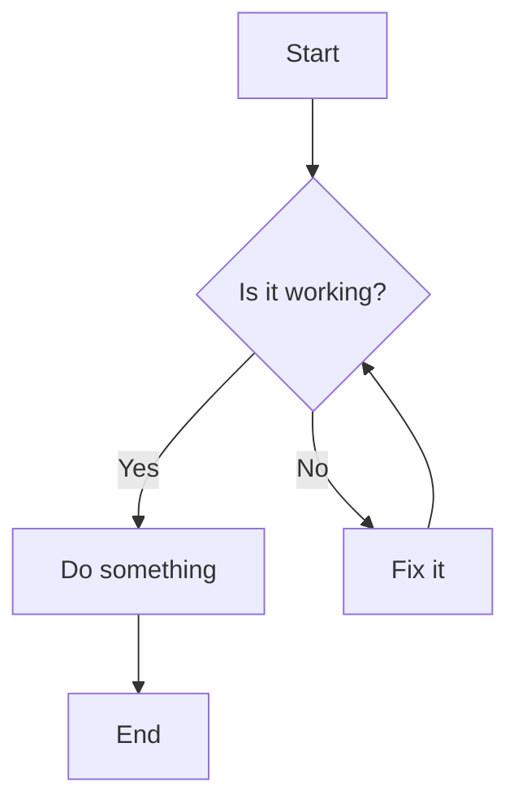
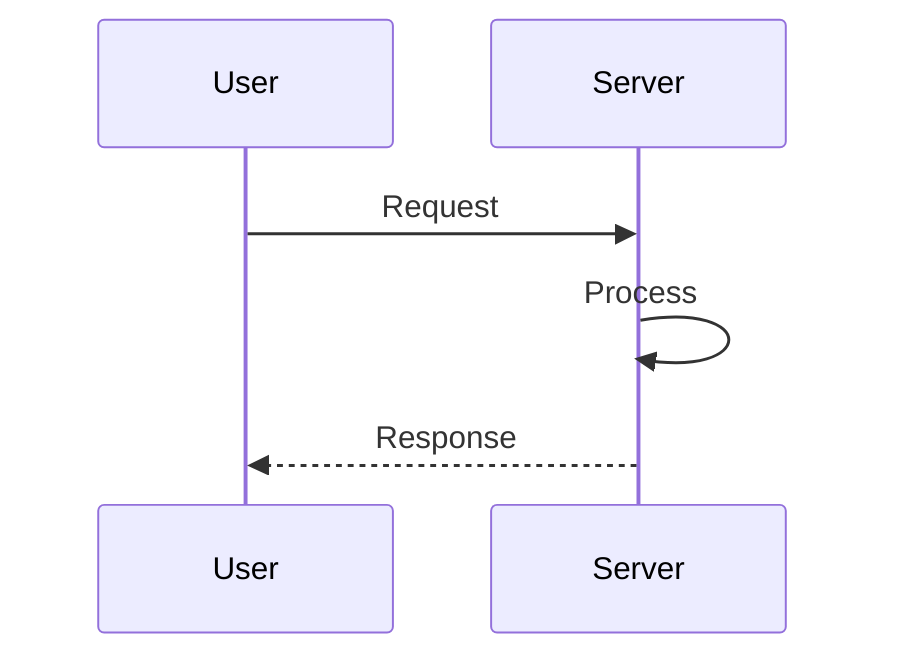

# Markstream Vue Demo

This is a comprehensive demo of markstream-vue features.

## Basic Formatting

- **Bold text**
- *Italic text*
- ~~Strikethrough~~
- `Inline code`
- [Link to GitHub](https://github.com/Simon-He95/markstream-vue)

## Code Blocks

```javascript
function greet(name) {
  console.log(`Hello, ${name}!`);
}

greet('World');
```

```python
def fibonacci(n):
    if n <= 1:
        return n
    return fibonacci(n-1) + fibonacci(n-2)
```

## Tables

| Feature | Status | Version |
|---------|--------|---------|
| Markdown | ✅ | 1.0 |
| Mermaid | ✅ | 1.0 |
| KaTeX | ✅ | 1.0 |
| D2 | ✅ | 1.0 |

## Math Formulas

Inline math: $E = mc^2$

Block math:

$$
\int_{0}^{\infty} e^{-x^2} dx = \frac{\sqrt{\pi}}{2}
$$

## Mermaid Diagram



## Mermaid Sequence Diagram



## D2 Diagram

```d2
title: System Architecture

web: Web Server
api: API Service
db: Database
cache: Redis Cache

web -> api: HTTP
api -> db: SQL
api -> cache: Get/Set
```

## Lists

### Unordered List
- Item 1
- Item 2
  - Nested Item 2.1
  - Nested Item 2.2
- Item 3

### Ordered List
1. First step
2. Second step
3. Third step

## Blockquote

> This is a blockquote.
> 
> It can span multiple paragraphs.

## Task List

- [x] Completed task
- [ ] Incomplete task
- [ ] Another incomplete task

## Emoji Support

Some emojis: 😄 🚀 💡 🎉
